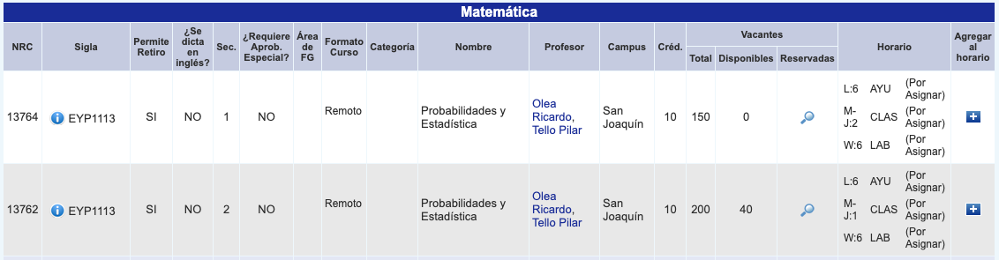
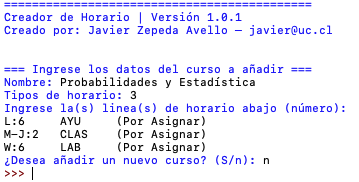

# HorarioUC-a-AppHorario
Hola! Hice un pequeño programa en Python para poder hacer de manera más fácil el horario de clases de la UC en la aplicación de [Horario/TimeTable](https://classtimetable.app/).

El horario generado por el programa puede ser importado únicamente si tienes:
1. La versión pagada en un dispositivo iOS o Android,
1. o si tienes un dispositivo iOS y un computador Mac (en este caso no es necesario tener la app pagada).

# ¿Cómo se usa?
Debes abrir y correr el archivo "a_maker.py".
El programa solicita la siguiente información: "Nombre del Curso", "Tipos de horario" y "Lineas de horario".

Debes abrir [BuscaCursos](http://buscacursos.uc.cl/) y obtener los datos como en el siguiente ejemplo:

Teniendo la siguiente información:

1. El nombre sería "Probabilidades y Estadística" (sin las comillas).
1. Tipos de horario corresponde al número de líneas que hay en la columna "Horario". En este caso hay tres (3) líneas (o "tipos"), las cuales corresponden a Ayudantía, Clase y Laboratorio.
    - Ojo, si tienes alguna categoría repetida (por ejemplo CLAS y CLAS en líneas diferentes), debes considerearlos como dos (2) tipos de horarios.
3. Y en Lineas de horario debes copiar el contenido de la columna Horario correspondiente a tu sección, para luego pegarlo en la consola Python.
3. Si deseas agregar otro ramo, en el input ingresa "S" (de sí... sin las comillas).

En la consola deberías tener esto al terminar:

Finalmente, en la carpeta se debería generar un archivo llamado "archivoGenerado.timetable". Este archivo puede ser importado en la aplicación de iOS o Android desde ajustes. Si tienes dispositivo iOS y un computador con MacOS y tienes descargada la app (que es gratis) en ambos dispositivos con la misma cuenta de iCloud, basta con importar el horario desde Ajustes en la app de TimeTable en tu computador MacOS.
